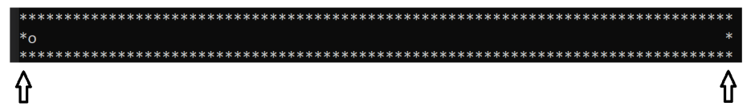

# Inclined Plane in Assembly P4

### Context

The body's accelaration is given by the board's accelerometer. The movement is uni-dimensional, i.e only on the x-axis.
The program reads the input given by the accelerometer periodically and uses it to compute and simulate the body's movement and outputs it in a visual way on the terminal

### Movement's simultaion

The body moves until it finds a wall. When it collides, it should bounce in the opposite direction. The terminal window, with maximum dimension of 80, shows the limits, or walls, as shown in the figure.

To simplify the computation of the bounce, it is assumed that after the velocity after the collision is the symetric of the velocity before the collision.